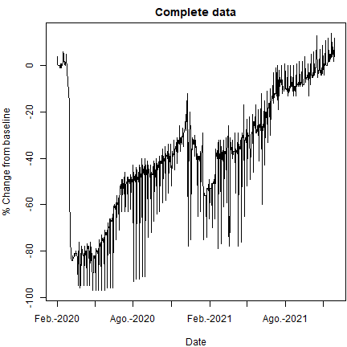
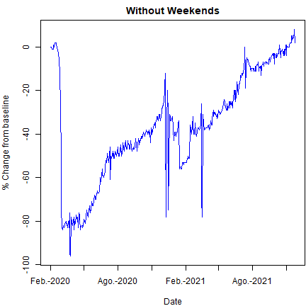

 Peru: Google COVID-19 Trends (Shiny APP)
========================================================
author: Karl Melgarejo Castillo
date: December 18, 2021.
autosize: true

<style>
.reveal .slides section .slideContent ul li{
    font-size: 20pt;
    color: black;
}
</style>


Motivation
========================================================

- Due to the COVID-19 pandemic, governments around the world have set restrictions to social mobility in order to avoid a further propagation of the virus.

- For this reason, Google has provided information about social mobility trends over time by geography, across different categories of places.

- I created a Shiny APP to access this Google data corresponding to the social mobility in Peru, my country.  

- I show 5 categories of places: retail and recreation, groceries and pharmacies, parks, transit stations, and workplaces.

- Also, this APP has the option to exclude weekends to have a better visualization of the trend in each indicator.


Google Data for Peru
========================================================

- I pre-processed the data to improve the speed of the APP. The principal variables are shown below, and the dimension of the data set:


```r
names(gm)[11:15]
```

```
[1] "retail_and_recreation_percent_change_from_baseline"
[2] "grocery_and_pharmacy_percent_change_from_baseline" 
[3] "parks_percent_change_from_baseline"                
[4] "transit_stations_percent_change_from_baseline"     
[5] "workplaces_percent_change_from_baseline"           
```

```r
dim(gm)
```

```
[1] 667  16
```

Some calculations 
========================================================

- To have a better visualization of the trend, this APP has the option to remove weekends. I show the code below.

- The number of observations when excluding the weekends is shown in the APP.


```r
  # Selecting only weekdays
  library(lubridate)
  gm$week <- wday(gm$date)
  gm_w <- gm[gm$week>1 & gm$week<7,]
  dim(gm)
```

```
[1] 667  17
```

```r
  dim(gm_w)
```

```
[1] 475  17
```

Plot of Retail and Recreation
========================================================

- Here I show one of the indicators that can be analysed in the APP, with and without weekends (blue line). 
- The last option helps to visualize the trend.



